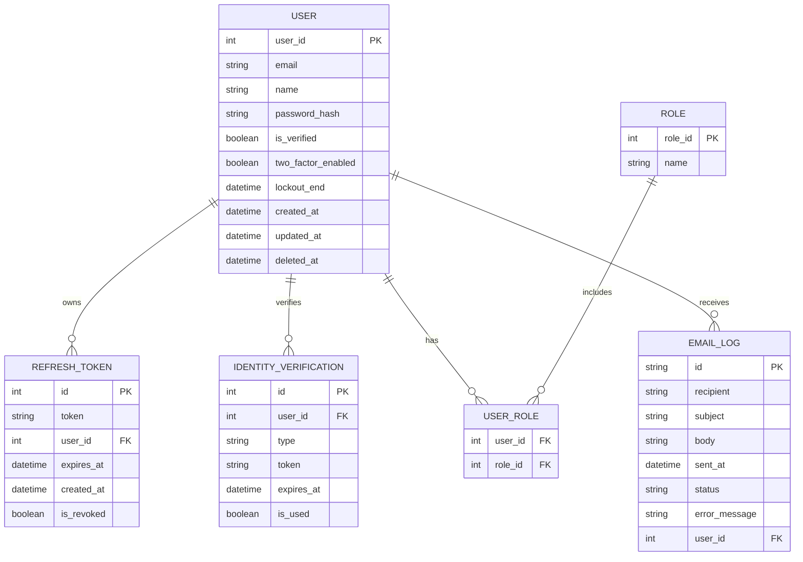

# Authenticate ERD

## Scope

Entities involved in authentication, authorization, and verification.

## Notes

- REFRESH_TOKEN.id can be Guid or int depending on implementation.
- IDENTITY_VERIFICATION.type values include Email_Confirmation and Password_Reset.
- USER_ROLE is a many-to-many join between USER and ROLE.
- EMAIL_LOG.user_id is nullable for guest recipients.
