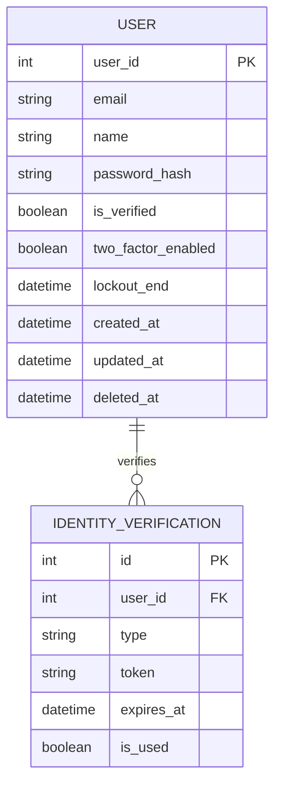

# Reset Password ERD

## Scope

Entities involved in password reset via token.

```mermaid
erDiagram
    USER ||--o{ IDENTITY_VERIFICATION : verifies

    USER {
        int user_id PK
        string email
        string name
        string password_hash
        boolean is_verified
        boolean two_factor_enabled
        datetime lockout_end
        datetime created_at
        datetime updated_at
        datetime deleted_at
    }

    IDENTITY_VERIFICATION {
        int id PK
        int user_id FK
        string type
        string token
        datetime expires_at
        boolean is_used
    }
```

## Notes

- type should include Password_Reset.
- is_used prevents replay attacks.
