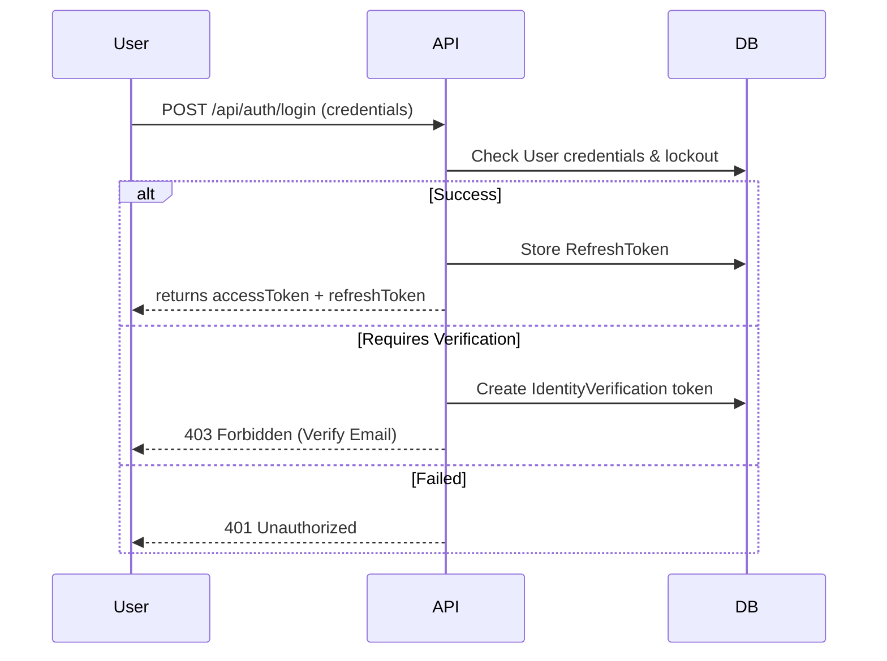

# Authenticate Workflow

## Goal

Provide secure login with refresh tokens, roles, and verification flows.

## Flow (High Level)

## Details

- **Scope**: Local login, role assignment, email/OTP verification, email tracking.
- **Roles**: Loaded via [[User_Role]] for authorization checks.
- **Logout**: Revokes refresh tokens in [[Refresh_Token]].

## ERD Reference

See [[Authenticate_ERD]].
