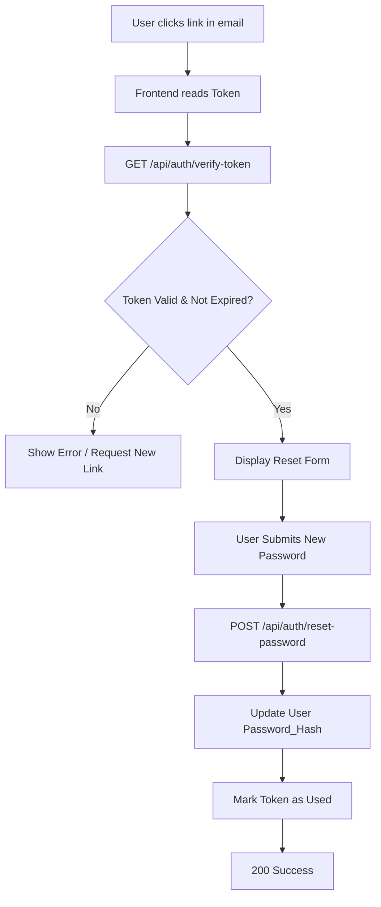

# Reset Password Workflow

## Goal

Allow users to reset their password using a time-limited token.

## Process Flow

## Security

- Use a short expiration window (15-30 minutes).
- `is_used` prevents replay attacks.
- Passwords are hashed with BCrypt.

## ERD Reference

See [[Reset_Password_ERD]].
